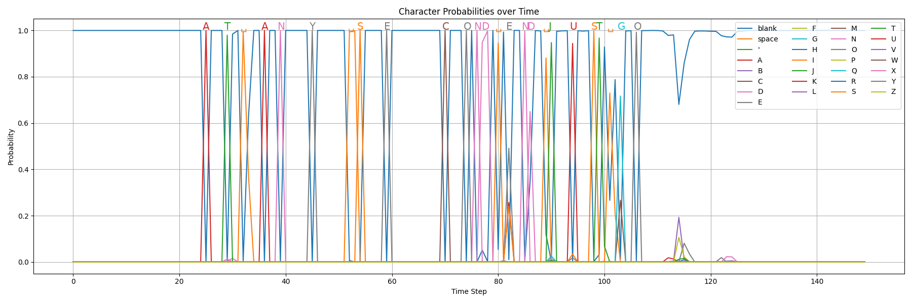

# Keyword Spotting Decoder

This repository provides a high-performance implementation of a Keyword Spotting (KWS) decoder in C++, designed to accelerate decoding in Python via pybind11.

KWS is essentially a streamlined beam search algorithm that looks for specified keywords directly in the output of an acoustic model (AM). For example, consider the output from an acoustic model for a WAV file where the speaker says:
"AT ANY SECOND AND JUST GO AND THEN WATCH EVERYBODY'S MOUTH DROP I WILL NOT BE OVER"



The image above shows the first few timesteps of the acoustic model's output for the given text (for clarity).

There are two main approaches to searching for specific keywords in audio:
1. **Transcribe the entire audio**: Convert all spoken words to text, then search for your keywords in the transcription.
2. **Direct keyword search in the acoustic model output**: Search for keywords directly in the AM output.

The first approach is prone to errors due to the influence of the language model (LM) during ASR decoding. The LM may alter the output to form more probable sentences, potentially causing actual spoken keywords to be missed or replaced with other words.

KWS addresses this issue by searching for your desired keywords directly in the acoustic model output, bypassing the language model and reducing the chance of missing keywords.

## Installation

The module is available on PyPI. You can install it with:

```bash
pip install kws-decoder
```

## Usage example

the following code shows a simple example that this module could be used:

```python
import numpy as np
from kws_decoder import KWSDecoder

labels = ["-", "|", "A", "B"]
blank_index = 0
decoder = KWSDecoder(labels, blank_index)

# you can set/get decoder parameters using setter/getter functions
decoder.set_beam_width(128)
decoder.set_beta(1.05)

# don't forget to add keywords to the decoder
keywords = ["AA", "AB"]
decoder.add_words(keywords)

# create a dummy am output
logits = np.random.randn(1000, 4).astype(np.float32)
exp_logits = np.exp(logits - logits.max(axis=1, keepdims=True))
probs = exp_logits / exp_logits.sum(axis=1, keepdims=True)

# then you can search through AM output
decoder.search(probs)
```

### (Optional) Run Sample Python Implementation Codes

The original code was developed in Python. To run the original implementation, install the package with:

```bash
pip install kws-decoder[ext]
```

This command installs `pygtrie`, `torch`, and `tqdm`, which are necessary to run the original implementation of the beam search algorithm. After installing the dependencies, you can run the script with the original Python implementation located in the test folder, specifically "beam_search.py".
